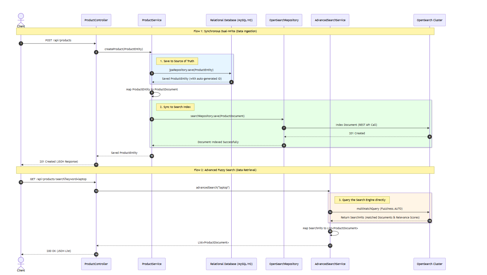

# Product Catalog with OpenSearch Dual-Write Architecture

A high-performance Spring Boot application demonstrating the integration of a relational database (Source of Truth) with OpenSearch (Search Engine) using a dual-write architecture.

This project provides blazing-fast, typo-tolerant full-text search capabilities over a product catalog while maintaining strict relational data integrity.

### Tech Stack
* **Framework:** Java 25, Spring Boot 4.x
* **Database:** Relational DB (via Spring Data JPA/Hibernate)
* **Search Engine:** OpenSearch 3.0.6
* **Infrastructure:** Docker & Docker Compose
* **Observability:** OpenSearch Dashboards

### Core Features
* **Synchronous Dual-Write:** Ensures data consistency by writing to the relational database first, then syncing the mapped document to OpenSearch.
* **Fuzzy Search:** Implements Levenshtein distance algorithms to handle user typos (e.g., searching "loptop" returns "laptop").
* **Advanced Querying:** Utilizes `NativeSearchQuery` and `multiMatchQuery` for complex, multi-field text analysis.
* **Separation of Concerns:** Maintains separate `Entity` classes for database normalization and flattened `Document` classes for search optimization.

### Local Setup

1. **Start the Infrastructure:**
   Ensure Docker is running, then spin up the OpenSearch cluster and Dashboards.
   ```bash
   docker-compose up -d


